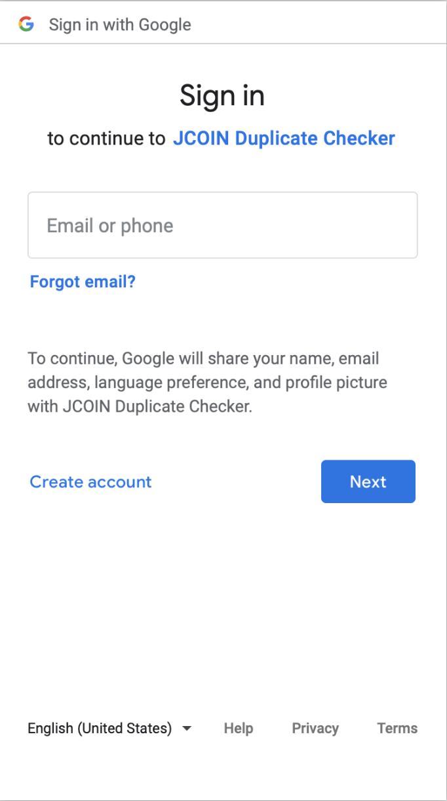
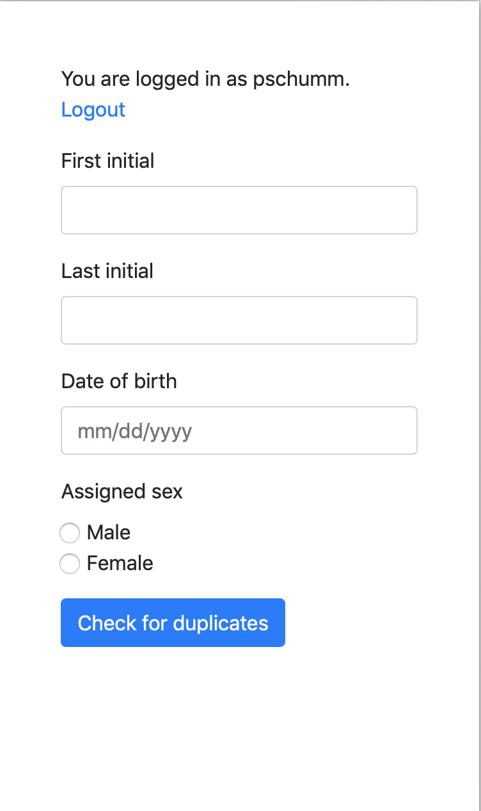
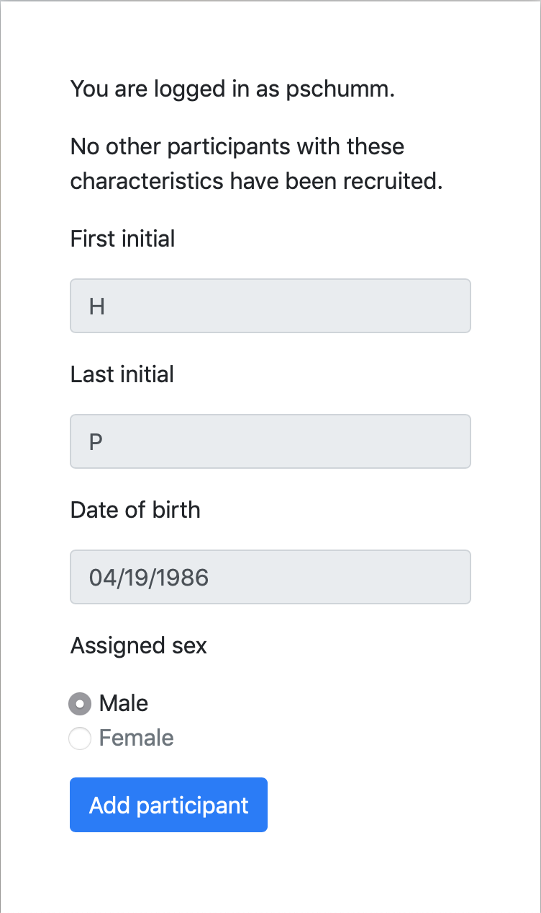
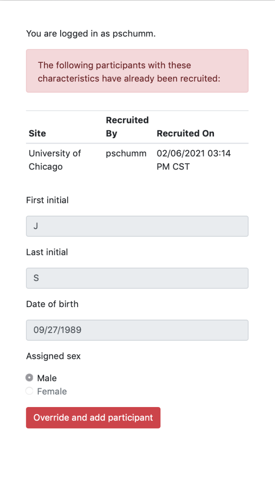

Overview
========

Description
-----------

Duplicate Checker is intended for use in situations where there is a risk of
enrolling the same person twice in a study, or in cases where two studies are
operating in the same area and they want to avoid enrolling the same person in
both. The purpose of Duplicate Checker is *to reduce the likelihood that the
same individual is enrolled twice* (or enrolled in multiple studies), not
eliminate it. Eliminating the possibility of duplicates would require a
careful check based on a unique identifier (e.g., social security number) or
multiple good identifiers (e.g., full name, mother's maiden name, etc.), both
of which carry an increased risk of disclosure. Instead, the approach taken by
Duplicate Checker is to utilize multiple fields which involve less risk of
disclosure (first and last initial, date of birth and assigned sex). A
duplicate based on these characteristics *may* indicate the same individual,
and the study coordinator/recruiter can then choose among several possible
actions, such as: (1) forgoing enrollment of the new participant, (2) querying
the participant further about possible previous enrollment, or (3) checking
with the staff member who enrolled the original matching individual to
determine whether the potential participant is indeed the same person. Thus,
Duplicate Checker may be used in situations where IRBs or other regulatory
groups prohibit the use of unique (or nearly unique) identifiers for this
purpose, or where concerns about the risk of disclosure outweigh the
advantages of using a more accurate method.

Duplicate Checker may be used via a web browser or via a web-based API. The
browser version works equally well on a desktop/laptop computer or mobile
device (phone or tablet). The API may be used to integrate Duplicate Checker
into existing platforms (e.g., a Case Management System or Clinical Database
Management System).

.. _info-encrypted:

All participant information (initials, date of birth and assigned sex) is
encrypted prior to storage, and the encryption key is stored separately. This
information is decrypted on demand in memory only for the fleeting moment when
a comparison is made, and not at any other time. Since the sole purpose of
storing this information is to avoid duplicates during the recruitment period,
it may be destroyed as soon as recruitment for the corresponding study (or
studies) is complete.

Authentication
--------------

Authentication to the browser interface is handled via OAuth 2.0 using Google.
Users will log in via their Google accounts, as shown in :numref:`fig-login`.
You will need to provide your Gmail address to the person administering
Duplicate Checker so that he or she can register you as an authorized user.

.. _fig-login:

   
   Login via Google

Authentication when using the API is handled via an API key that will be
provided to you. It is critical that you store and use this key in a secure
manner.

Usage
-----

When you first login, you will see a form into which you can enter a potential
participant's first initial, last initial, date of birth and assigned sex
(:numref:`fig-home`). Initials may be capitalized or lower case (it doesn't
matter), but the date of birth must be entered using the format shown in the
corresponding input field (mm/dd/yyyy).

.. _fig-home:

   
   Form for entering participant information

To avoid ambiguity, we suggest the following guidelines:

- If an individual uses his or her middle name instead of the first (e.g.,
  "Hildegard Amy Smith" goes by "Amy Smith"), use the first letter of the
  middle name as the first initial. Do not use the first letter of a nickname
  (e.g., "John Doe" goes by "Slick").
- If an individual has a hyphenated or two-part last name, use the first
  letter of the first part as the last initial.
- One of the limitations in using the last name (or initial) for duplicate
  checking is that it will fail in cases where a woman is enrolled in a study
  and then marries (or becomes divorced) and changes her last name.
  Unfortunately, there is no good way to address this. We suggest that in
  cases where it is known that a woman has recently married (or become
  divorced) and changed her name, two checks be performed: one with the first
  letter of her previous last name and one with the first letter of her
  current last name. Also, we suggest that when adding a new participant the
  first letter of his or her *current* last name is used in all cases.
- Finally, the attribute *assigned sex* (also referred to as birth sex) is
  intentionally used to avoid ambiguity.

Once you have entered the required information, you may click on the "Check
for duplicates" button. If no duplicates are found, you will be told this and
then given the opportunity to add the new participant to the database
(:numref:`fig-add`). Note that at this point you cannot modify the participant
information you have entered; if you realize you have made a mistake in
entering the information, use your browser's "Back" button to correct it.

.. _fig-add:

   
   Adding a new participant

.. warning:: Do not add a new participant until you are sure that you are
    going to enroll the person, since there is no way to delete an individual
    once he or she has been added. In fact, our recommendation is that you
    check for duplicates during the screening process but *do not add the
    participant at that time*. You may then go back and add the participant
    after he or she has consented to participate. If you need to remove an
    individual from the database (e.g., if the person decides not to
    participate after he or she has been entered or if you subsequently
    determine that the information entered is incorrect), contact the system
    administrator and he or she can do this for you.

If a duplicate is found, then you will be shown where and when that individual
was recruited, as well as the name of the user who entered that individual
into the system (:numref:`fig-dup`). At this point, you may wish to
double-check whether the individual was indeed previously enrolled, either by
checking with the user who added the original participant and/or by checking
again with the new potential participant. If you determine that the new
participant is indeed a different individual from the previous one (e.g., if
they simply happen to share the same initials, dob and sex), then you may use
the "Override and add participant" button to add the person. Note that you
should do this if you have decided to enroll the new participant even though
an individual with those characteristics already exists in the database, both
for completeness and so that if either of the two individuals appears again
you will have a complete record of what has gone on.

.. _fig-dup:

   
   Duplicate found
